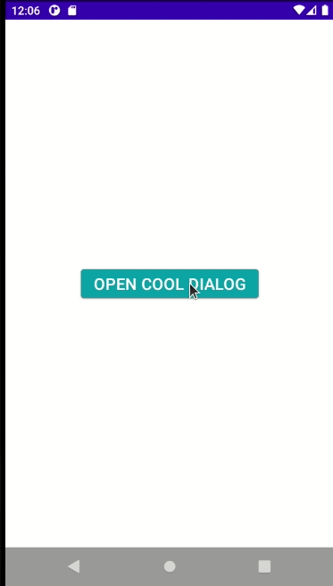

# CoolDialog: v1.0.7-a1
## _Make your android applications better!_

[](https://jitpack.io/#EdinHas26/CoolDialog)

## Introduction

**CoolDialog** is Android Library focused on modern dialog design,
implementing CircleImageView with enough TextView fields and Buttons for everyone.
Main purpose of CoolDialog is "profile-like" dialogs to show user profile preview, but with many
design features to adapt it to your needs.


## Features

- CircleImageView, 4x TextView, 2x MaterialButton
- Wrapped in modern designed CardView with rounded edges
- Hide/Show Views with functions like dialog.hideCancelButton()
- Change CircleImageSize and adjust it to your needs
- Retrieve TextView or MaterialButton and design it however you want!


## Implementation

Implementation of CoolDialog is really easy. Just like any other dialog with few extra features. 

### Prerequisite
#### i. Gradle

In `Build.Gradle` of app module, include these dependencies. This library is available on [maven { url 'https://jitpack.io' }](https://jitpack.io/#EdinHas26/CoolDialog)

```groovy
allprojects {
	repositories {
		...
		maven { url 'https://jitpack.io' }
	}
}

dependencies {
    implementation 'com.github.EdinHas26:CoolDialog:v1.0.7-a1'
}
```
#### ii. Set up Material Theme
In order for CoolDialog to work setting Material Theme to app is necessary. To set this up update [`themes.xml`](app\src\main\res\values\themes.xml) of `values` directory in app.
```xml
<resources>
    <style name="AppTheme" parent="Theme.MaterialComponents.Light.NoActionBar">
        <!-- Customize your theme here. -->
        ...
    </style>
</resources>
```
These are required prerequisites to implement CoolDialog library.

#### iii. Create Dialog Instance

To create new instance of `CoolDialog` just call `CoolDialog` constructor like this.
```kotlin
val coolDialog: CoolDialog = CoolDialog(this)
coolDialog.requestWindowFeature(Window.FEATURE_NO_TITLE)
coolDialog.requestContentView() //This function requests layout for CoolDialog which is fixed. Calling .setContentView(contentView) won't change the layout of the CoolDialog
coolDialog.setCancelOnTouchOutside(false) //Touch outside dialog window won't close it
val dialogWindow = coolDialog.window
dialogWindow?.setLayout(AbsListView.LayoutParams.MATCH_PARENT, AbsListView.LayoutParams.WRAP_CONTENT)
coolDialog.show() //This shows dialog
```


## Methods

To work with `CoolDialog` you can use many of the methods defined on the base Dialog class from Android. What CoolDialog brings to the table is modification of Views inside the dialog_layout.xml which is not accessible otherwise.

#### i. Change Text on TextViews
CoolDialog has four TextView's create inside LinearLayout with `vertical` orientation, one below each other. In order to change text there are simple methods which can be used:

- `.setTextOnFirstTextView(text: String)`
- `.setTextOnSecondTextView(text: String)`
- `.setTextOnThirdTextView(text: String)`
- `.setTextOnFourthTextView(text: String)`

The methods above can be used to set text on each TextView individually from top to bottom where `setTextOnFirstTextView` is the first one on top. Even better solution is that you can programmatically change text on all four of the TextViews inside CoolDialog:

- `.setTextToAll(text: String, text2: String, text3: String, text4: String)`

This will change text on all four of the TextViews. When it comes to `MaterialButton` you can also change text:

- `.setCallButtonText(text: String)`
- `.setCancelButtonText(text: String)`

This will change text on two buttons inside `dialog_layout.xml` where `CallButton` is the button just below TextViews and `CancelButton` is button on bottom of the dialog layout used to dismiss dialog.

#### ii. Set Image Resource

To set your image inside CircleImageView you can use the method:
- `.setImageResource(id: Int)`

Example of this would be `coolDialog.setImageResource(R.drawable.profile_picture)`

Or if you want to load image from the url you can do it like this:

- `.setImageResource(yourImageUrl)`

This will load image from the url but before that you need to add Internet permission in your `AndroidManifest.xml`

```xml
<uses-permission android:name="android.permission.INTERNET" />
```

# UNDER CONSTRUCTION

