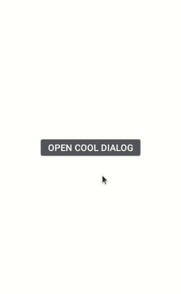

# CoolDialog: v1.0.9-a1
## _Make your android applications better!_

[](https://jitpack.io/#EdinHas26/CoolDialog)

## Introduction

**CoolDialog** is Android Library focused on modern dialog design,
implementing CircleImageView with enough TextView fields and Buttons for everyone.
Main purpose of CoolDialog is "profile-like" dialogs to show user profile preview, but with many
design features to adapt it to your needs.


## Features

- CircleImageView, 4x TextView, 2x MaterialButton
- Wrapped in modern designed CardView with rounded edges
- Hide/Show Views with functions like dialog.hideCancelButton()
- Change CircleImageSize and adjust it to your needs
- Retrieve TextView or MaterialButton and design it however you want!


## Implementation

Implementation of CoolDialog is really easy. Just like any other dialog with few extra features. 

### Prerequisite
#### i. Gradle

In `Build.Gradle` of app module, include these dependencies. 

```groovy
allprojects {
	repositories {
		...
		maven { url 'https://jitpack.io' }
	}
}

dependencies {
    implementation 'com.github.EdinHas26:CoolDialog:v1.0.9-a1'
}
```
This library is available on [maven { url 'https://jitpack.io' }](https://jitpack.io/#EdinHas26/CoolDialog)
#### ii. Set up Material Theme
In order for CoolDialog to work setting Material Theme to app is necessary. To set this up update [`themes.xml`](app\src\main\res\values\themes.xml) of `values` directory in app.
```xml
<resources>
    <style name="AppTheme" parent="Theme.MaterialComponents.Light.NoActionBar">
        <!-- Customize your theme here. -->
        ...
    </style>
</resources>
```
These are required prerequisites to implement CoolDialog library.

### Create Dialog Instance

To create new instance of `CoolDialog` just call `CoolDialog` constructor like this.
```kotlin
val coolDialog: CoolDialog = CoolDialog(this)
coolDialog.requestWindowFeature(Window.FEATURE_NO_TITLE)
coolDialog.requestContentView() //This function requests layout for CoolDialog which is fixed. Calling .setContentView(contentView) won't change the layout of the CoolDialog
coolDialog.setCancelOnTouchOutside(false) //Touch outside dialog window won't close it
val dialogWindow = coolDialog.window
dialogWindow?.setLayout(AbsListView.LayoutParams.MATCH_PARENT, AbsListView.LayoutParams.WRAP_CONTENT)
coolDialog.show() //This shows dialog
```


## Methods

To work with `CoolDialog` you can use many of the methods defined on the base Dialog class from Android. What CoolDialog brings to the table is modification of Views inside the dialog_layout.xml which is not accessible otherwise. What you can do:

-  Get every view from dialog_layout.xml to customize it to your needs
-  Set ImageView resource from drawable folder or from URL (this requires Internet connection)
-  Set text on each element at once or one by one
-  Hide/Show TextViews and Buttons
-  Set text, text color and button background on each button
-  Set ImageView size
-  Change ImageView stroke color
-  Change dialog background

#### i. Request content view
CoolDialog has fixed layout which can not be changed. In order to set content view on dialog you can simply call `.requestContentView()` which sill set `dialog_layout.xml` as selected layout. Dialog method `.setContentView(layoutResID: Int)` will not change the layout of the dialog but simpy set `dialog_layout.xml` as layout resource again. It looks like this:

```kotlin
val coolDialog: CoolDialog = CoolDialog(this)
coolDialog.requestWindowFeature(Window.FEATURE_NO_TITLE)
coolDialog.requestContentView()
...
```

#### ii. Get views from dialog_layout.xml
In order to let you customize the layout to your needs there is option to get layout views and call view methods as you wish. To do this you have these functions at your service:

- `.getFirstTextView()` - retrieves TextView
- `.getSecondTextView()` - retrieves TextView
- `.getThirdTextView()` - retrieves TextView
- `.getFourthTextView()` - retrieves TextView
- `.getCallButtonView()` - retrieves MaterialButton
- `.getCancelButtonView()` - retrieves MaterialButton

#### ii. TextView 
CoolDialog has four TextView's created inside LinearLayout with `vertical` orientation, one below each other. 
###### a. Set text on TextViews
In order to change text there are simple methods which can be used:

- `.setTextOnFirstTextView(text: String)`
- `.setTextOnSecondTextView(text: String)`
- `.setTextOnThirdTextView(text: String)`
- `.setTextOnFourthTextView(text: String)`

The methods above can be used to set text on each TextView individually from top to bottom where `setTextOnFirstTextView` is the first one on top. Even better solution is that you can programmatically change text on all four of the TextViews inside CoolDialog:

- `.setTextToAll(text: String, text2: String, text3: String, text4: String)`

This will change text on all four of the TextViews.

```kotlin
coolDialog.setTextToAll("ANNIE FOX", "annie.fox@droidev.com", "812-913-7452", "New Jersey, NY, USA")
```

###### b. Show/Hide TextViews
If you want to hide/show only few of the four TextViews you can do it with these methods:

- `coolDialog.hideFirstTextVieW()`
- `coolDialog.hideSecondTextView()`
- `coolDialog.hideThirdTextView()`
- `coolDialog.hideFourthTextView()`
- `coolDialog.showFirstTextView()`
- `coolDialog.showSecondTextView()`
- `coolDialog.showThirdTextView()`
- `coolDialog.showFourthTextView()`

If you want to show/hide more than one TextView at the time you can do it like this:
- `coolDialog.hideTextView(position)`
- `coolDialog.showTextView(position)`

Where `position` is position of the TextView from 0 to 3. In order to hide/show more than one TextView just type like this:

```kotlin
coolDialog.hideTextView(0, 3)
```

This will hide the first an the last TextView. Another way to do this is to set visibility on view instead of calling show/hide functions:
```kotlin
coolDialog.setTextViewVisibility(View.GONE, 0, 2)
coolDialog.setTextViewVisibility(View.VISIBLE, 1)
```

Again you can send more than one position at time but there must be minimum of one position to set the visibility.

###### c. Set color for the TextViews
If you want to change the color of the text you can do it like this:
```kotlin
coolDialog.setDialogTextColor("#000000")
coolDialog.setDialogTextColor(R.color.colorPrimary)
```
Text color can be changed by sending hex color code as String or sending color id.

#### iii. MaterialButton
There are two buttons inside CoolDialog named CallButton and CancelButton. Methods on buttons are simple and easy to implement. 
###### a. Set text on buttons
In order to change text on CallButton or CancelButton you can call these methods:
```kotlin
coolDialog.setCallButtonText("call")
coolDialog.setCancelButtonText("cancel")
```

###### b. Hide/Show buttons
If you want to show/hide buttons you can just call:
```kotlin
coolDialog.showCallButton()
coolDialog.hideCallButton()
```
or for CancelButton:
```kotlin
coolDialog.showCancelButton()
coolDialog.hideCancelButton()
```

###### c. Change button and button text color
To change the text color of the call button just use this:
```kotlin
coolDialog.setCallButtonTextColor(R.color.colorPrimary)
coolDialog.setCallButtonColor(R.color.colorAccent) // or you can use hex color codes like this .setCallButtonColor("#000000") 
```
or for CancelButton:
```kotlin
coolDialog.setCancelButtonTextColor(R.color.colorPrimary)
coolDialog.setCancelButtonColor(R.color.colorAccent) // or you can use hex color codes like this .setCallButtonColor("#000000") 
```
Button text color can be changed by sending hex color code as String or sending color id.

###### d. Set icon and icon color for CallButton
Call button has icon which can be changed. You can simply use these methods to change the icon or change its color. To change icon resource:
```kotlin
coolDialog.setCallButtonIconResource(drawable: Drawable)
coolDialog.setCallButtonIconResource(resourceID: Int)
```
As you can see there are two ways to change the icon resource. One is to send drawable and the other one is to send drawable id. In order to change its color you can do it like this:
```kotlin
coolDialog.setCallButtonIconColor(R.color.colorPrimary)
```

###### e. Set onClickListener on buttons
To create click listener on buttons you can simply use this:
```kotlin
coolDialog.setCancelButtonOnClickListener(listener)
coolDialog.setCallButtonOnClickListener(listener)
```

#### iv. CircleImageView
CoolDialog impelements CircleImageView library so you can show modern-like profile images. 
###### a. Change image resource
To change your resource image inside CircleImageView from drawable folder you can use this:
```kotlin
coolDialog.setImageResource(R.drawable.profile_picture)
```
or like this:
```kotlin
coolDialog.setImageResource(url)
```
The latter loads image from the Internet using Glide library, so to use this you need Internet connection. Because of that you need to add Internet permission inside your `AndroidManifest.xml` file:
```xml
<uses-permission android:name="android.permission.INTERNET" />
```

###### b. Set image size
To change image size you can use `.setImageSize(size: Int)` method. This method will change not only the image size but reorder TextViews and everything else so there is no overlapping between views. There is calculation done on screen dimensions in the background when CoolDialog is first initialized but sometimes this doesn't work. In order to change that you can simply experiment with image size to get what you like.
```kotlin
coolDialog.setImageSize(150)
```

###### c. Change image stroke color
CircleImageView has stroke color around its view and you can also change this. By default this color matches with CancelButton color but it doesn't have to be like that. To change this color you can simply use this:
```kotlin
coolDialog.setImageStrokeColor("#000000")
```
or like this:
```kotlin
coolDialog.setImageStrokeColor(R.color.colorPrimary)
```

### v. Dialog background
If you want to change the background color of the dialog you can use this:
```kotlin
coolDialog.setDialogBackground("#000000")
```
or like this:
```kotlin
coolDialog.setDialogBackground(R.color.colorPrimary)
```

# Credits
This library is built using following libraries:
- [CircleImageView](https://github.com/hdodenhof/CircleImageView)
- [Glide](https://github.com/bumptech/glide)
- [MaterialComponents](https://www.material.io/)

# Contribute
You can contribute to this library by filing issues, bugs, etc.

# License
Copyright [2021] [Edin Hasanović: https://github.com/EdinHas26]

Licensed under the Apache License, Version 2.0 (the "License");
you may not use this file except in compliance with the License.
You may obtain a copy of the License at

http://www.apache.org/licenses/LICENSE-2.0

Unless required by applicable law or agreed to in writing, software
distributed under the License is distributed on an "AS IS" BASIS,
WITHOUT WARRANTIES OR CONDITIONS OF ANY KIND, either express or implied.
See the License for the specific language governing permissions and
limitations under the License.
